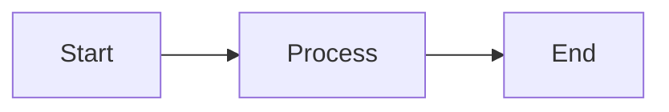

# mdpdf-link v0.9

A statically hosted, URL-driven Markdown→PDF renderer that runs entirely in the browser.

## Overview

mdpdf-link v0.9 is a deterministic, client-side PDF renderer that:
- Fetches Markdown documents via URL parameters
- Parses YAML frontmatter for document metadata
- Compiles using Typst in WASM for high-quality typesetting
- Renders Markdown through cmarker integration
- Supports Mermaid diagrams via oxdraw
- Requires no server-side compute

## Usage

Navigate to the renderer with a source URL:

```
render.html?src=https://example.com/document.md
```

The system will:
1. Fetch the Markdown document from the specified URL
2. Parse any YAML frontmatter (title, author, date, etc.)
3. Convert Markdown to Typst format using cmarker-style conversion
4. Compile the document using Typst WASM
5. Display the PDF natively in the browser
6. Offer a download option

## Quick Start

### Local Testing

To test locally with the included sample:

```bash
# Serve the files using any static file server
python3 -m http.server 8000
# or
npx serve
```

Then navigate to:
```
http://localhost:8000/render.html?src=http://localhost:8000/sample.md
```

### Deployment

Simply deploy the following files to any static hosting service:
- `render.html` - Main application page
- `render.js` - JavaScript orchestrator
- Any markdown files you want to render

No build step or server configuration required.

## Features

### YAML Frontmatter
Add metadata to your documents:

```yaml
---
title: My Document
author: John Doe
date: 2026-01-09
---
```

### Markdown Support
Standard Markdown features:
- Headers (h1-h4)
- **Bold** and *italic* text
- [Links](https://example.com)
- Code blocks with syntax highlighting
- Lists (ordered and unordered)
- Paragraphs with proper spacing

### Mermaid Diagrams
Include diagrams using Mermaid syntax:



## Architecture

The application consists of three main components:

1. **HTML Interface (`render.html`)**
   - Minimal UI for status and PDF display
   - PDF viewer with download functionality

2. **JavaScript Orchestrator (`render.js`)**
   - URL parameter parsing
   - Markdown fetching
   - YAML frontmatter extraction
   - Markdown→Typst conversion
   - WASM initialization and compilation
   - PDF rendering and delivery

3. **WASM Compilation**
   - Typst WASM for PDF generation
   - cmarker for Markdown processing
   - oxdraw for Mermaid diagrams

## Technical Details

- **Statically Hosted**: No server-side processing required
- **URL-Driven**: Source documents specified via query parameters
- **Client-Side Compilation**: All processing happens in the browser
- **Deterministic**: Same input always produces same output
- **Zero Backend**: No compute, databases, or APIs needed

## Browser Requirements

- Modern browser with WebAssembly support
- JavaScript enabled
- PDF display capabilities (built-in viewer)

## License

Open source - see repository for details.

## Version

Current version: 0.9
