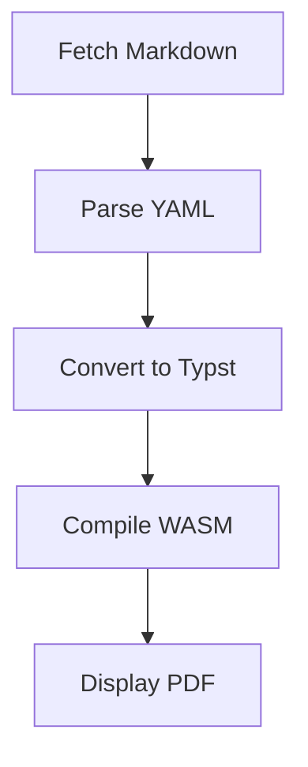

# Introduction

This is a sample Markdown document to demonstrate **mdtypst v0.9**, a statically hosted, URL-driven Markdown→PDF renderer.

## Features

The system includes:

- **YAML Frontmatter Parsing**: Extract metadata from documents
- **Typst WASM Compilation**: Client-side PDF generation
- **Markdown Rendering**: Via cmarker integration
- **Mermaid Diagrams**: Rendered through oxdraw
- **Zero Server Compute**: Everything runs in the browser

## Usage

Simply navigate to:

```
render.html?src=URL
```

Where `URL` points to a Markdown document.

## Example Diagram



## Code Example

Here's a simple code snippet:

```javascript
async function render(url) {
    const md = await fetch(url);
    const pdf = await compile(md);
    display(pdf);
}
```

## Formatting

You can use *italic*, **bold**, and [links](https://example.com).

### Lists

Unordered lists:
- Item one
- Item two
- Item three

Ordered lists:
1. First item
2. Second item
3. Third item

## Conclusion

This demonstrates the deterministic, client-side rendering capabilities of mdtypst v0.9.
