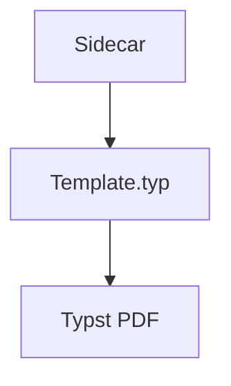

# Sidecar basic

This Markdown file has **no YAML frontmatter**.

Styling and document settings are provided by the sibling sidecar file.

```mermaid
graph TD
  A[Sidecar] --> B[Template.typ]
  B --> C[Typst PDF]
```

- Item 1
- Item 2
